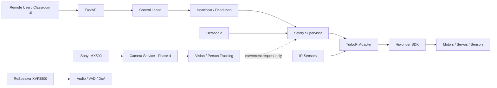

# ZeeAIBotWebCam

**Affordable AI-Powered Robotic Video Conferencing System Using Raspberry Pi and Python for Hybrid Active Learning Classrooms**

ZeeAIBotWebCam is a production-oriented research and teaching platform built around **Hiwonder TurboPi + Raspberry Pi + Sony IMX500 AI Camera + Python + Edge AI + WebRTC**.

The repository follows a phased engineering process. The current software now includes the production hardware boundary and central safety layer, while real chassis movement remains intentionally locked until physical calibration is complete.

## Project status

| Phase | Scope | Status |
|---|---|---|
| Phase 0 | Engineering analysis and architecture | ✅ Documented |
| Phase 1 | Development environment and software foundation | ✅ Implemented |
| Phase 2 | Physical hardware validation | 🧪 Baseline validated; calibration follow-ups remain |
| Phase 3 | TurboPi production hardware adapter + safety supervisor | ✅ Phase 3A/3B implemented |
| Phase 4 | Sony IMX500 AI Camera service and inference layer | ⏳ Next |
| Phase 5+ | Tracking, ReSpeaker fusion, WebRTC, active-speaker AI, hardening | ⏳ Planned |

## Current validated hardware baseline

The project has already verified enough real hardware to continue software development:

- Raspberry Pi Remote SSH development;
- project runtime on Raspberry Pi;
- Hiwonder UART on `/dev/ttyAMA0`;
- Hiwonder controller communication;
- I2C bus availability;
- ultrasonic sensor discovery;
- Sony IMX500 AI Camera detection and still capture;
- servo power rail around 4.7–4.97 V;
- at least one PWM servo physically moving.

Open Phase 2 calibration items remain:

- identify and calibrate both pan/tilt servo channels;
- map the four IR channels to physical positions;
- validate ReSpeaker XVF3800 capture/DoA path;
- validate speaker output;
- map all four motor IDs and polarity;
- resolve battery telemetry interpretation before chassis movement.

## Core safety rule

> **AI, web, vision and conference modules must never command motors directly.**
>
> All chassis or pan/tilt movement must pass through the central Safety Supervisor and the TurboPi hardware adapter.

The application defaults to:

```yaml
hardware:
  mode: mock
  motor_mapping_validated: false
  pan_tilt:
    enabled: false

safety:
  motion_enabled: false
```

So normal application startup cannot drive the robot.

## Phase 3 architecture



## Repository layout

```text
ZeeAIBotWebCam/
├── config.yaml
├── pyproject.toml
├── src/robotic_classroom/
│   ├── core/
│   ├── control/
│   ├── hardware/
│   ├── safety/
│   └── web/
├── tests/
├── scripts/
├── vendor/
└── docs/
```

## Phase documentation

- [`docs/phase-00-engineering-analysis.md`](docs/phase-00-engineering-analysis.md)
- [`docs/phase-01-development-environment.md`](docs/phase-01-development-environment.md)
- [`docs/phase-02-hardware-validation.md`](docs/phase-02-hardware-validation.md)
- [`docs/phase-03-hardware-adapter-safety.md`](docs/phase-03-hardware-adapter-safety.md)
- [`docs/hardware-api-inventory.md`](docs/hardware-api-inventory.md)
- [`docs/architecture.md`](docs/architecture.md)
- [`docs/safety.md`](docs/safety.md)

## Run Phase 3 in mock mode

### Raspberry Pi / Linux

```bash
cd ~/ZeeAIBotWebCam
git pull
source .venv/bin/activate
export HARDWARE_MODE=mock
pytest -v
python -m robotic_classroom.main
```

Open:

- `http://127.0.0.1:8000/health`
- `http://127.0.0.1:8000/ready`
- `http://127.0.0.1:8000/api/sensors`
- `http://127.0.0.1:8000/api/safety`
- `http://127.0.0.1:8000/docs`

## Phase 3 safe API surface

The application currently exposes only safety/status operations:

```text
GET  /health
GET  /ready
GET  /api/sensors
GET  /api/safety
POST /api/control/lease
POST /api/control/heartbeat
POST /api/control/emergency-stop
POST /api/control/reset-stop
```

There is deliberately **no public movement endpoint** yet.

## Real sensor mode without enabling movement

After reviewing the configuration, set:

```yaml
hardware:
  mode: real

safety:
  motion_enabled: false
```

Then the API can expose real battery/ultrasonic/IR telemetry while movement remains disabled.

## Upstream hardware SDK

Hiwonder TurboPi:

https://github.com/Hiwonder/TurboPi

The project keeps the upstream Hiwonder code in `vendor/TurboPi` and wraps it through `TurboPiAdapter` rather than duplicating vendor drivers.

## Privacy baseline

The design defaults to:

- no face recognition;
- no biometric identity database;
- no recording;
- no cloud upload of raw classroom video by default;
- on-device person detection/tracking where practical;
- explicit indicators for camera, microphone and conference state.

## Next phase

**Phase 4** will turn the already validated Sony IMX500 camera into a proper application service with:

- one camera owner;
- shared frame distribution;
- IMX500 person detection;
- metadata extraction;
- mock camera backend;
- tests;
- no direct movement from vision code.
