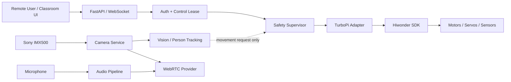

# ZeeAIBotWebCam

**Affordable AI-Powered Robotic Video Conferencing System Using Raspberry Pi and Python for Hybrid Active Learning Classrooms**

ZeeAIBotWebCam is a production-oriented research and teaching platform built around **Hiwonder TurboPi + Raspberry Pi + Sony IMX500 AI Camera + Python + Edge AI + WebRTC**.

The repository follows a phased engineering process. The first two phases establish the verified architecture and a safe, testable software foundation before any autonomous or remote movement is enabled.

## Project status

| Phase | Scope | Status |
|---|---|---|
| Phase 0 | Engineering analysis and architecture | ✅ Documented |
| Phase 1 | Development environment and software foundation | ✅ Implemented |
| Phase 2 | Physical hardware validation | ⏳ Next |
| Phase 3 | TurboPi production hardware adapter + safety supervisor | ⏳ Planned |
| Phase 4 | Sony IMX500 AI Camera integration | ⏳ Planned |
| Phase 5+ | Camera service, telepresence, tracking, WebRTC, active-speaker AI, hardening | ⏳ Planned |

## Core safety rule

> **AI, web, vision and conference modules must never command motors directly.**
>
> All future chassis or pan/tilt movement must pass through a centralized safety controller and a verified TurboPi hardware adapter.

Phase 1 therefore provides **no movement endpoint** and defaults to:

```yaml
hardware:
  mode: mock

safety:
  motion_enabled: false
```

## Architecture at a glance



## Repository layout

```text
ZeeAIBotWebCam/
├── config.yaml
├── pyproject.toml
├── src/robotic_classroom/
│   ├── core/
│   ├── hardware/
│   └── web/
├── tests/
├── scripts/
├── vendor/
└── docs/
```

## Phase documentation

- [`docs/phase-00-engineering-analysis.md`](docs/phase-00-engineering-analysis.md)
- [`docs/phase-01-development-environment.md`](docs/phase-01-development-environment.md)
- [`docs/hardware-api-inventory.md`](docs/hardware-api-inventory.md)
- [`docs/architecture.md`](docs/architecture.md)
- [`docs/safety.md`](docs/safety.md)

## Quick start — mock mode

### Linux / Raspberry Pi

```bash
python3 -m venv .venv
source .venv/bin/activate
python -m pip install --upgrade pip
pip install -e ".[dev]"
python -m robotic_classroom.main
```

### Windows PowerShell

```powershell
py -m venv .venv
.\.venv\Scripts\Activate.ps1
python -m pip install --upgrade pip
pip install -e ".[dev]"
$env:HARDWARE_MODE="mock"
python -m robotic_classroom.main
```

Open:

- `http://127.0.0.1:8000/health`
- `http://127.0.0.1:8000/ready`
- `http://127.0.0.1:8000/docs`

Run tests:

```bash
pytest -v
```

## Raspberry Pi setup

Use the bootstrap helper only after reviewing it:

```bash
chmod +x scripts/bootstrap_pi.sh
./scripts/bootstrap_pi.sh
```

The Hiwonder repository is treated as external vendor software and is cloned to `vendor/TurboPi` by the bootstrap script. The upstream SDK is not duplicated or rewritten inside this application.

## Upstream hardware SDK

Hiwonder TurboPi:

https://github.com/Hiwonder/TurboPi

Phase 0 verified the real vendor APIs before designing this project. See the hardware inventory document for the exact API names currently relied upon.

## Privacy baseline

The initial design defaults to:

- no face recognition;
- no biometric identity database;
- no recording;
- no cloud upload of raw classroom video by default;
- on-device person detection/tracking where practical;
- explicit indicators for camera, microphone and conference state.

## Current limitation

Phase 1 intentionally does **not** prove the physical robot configuration. Raspberry Pi model, OS version, controller serial communication, motor directions, servo limits, sonar units, IMX500 detection, microphone and speaker must be validated physically during Phase 2 before movement is enabled.
