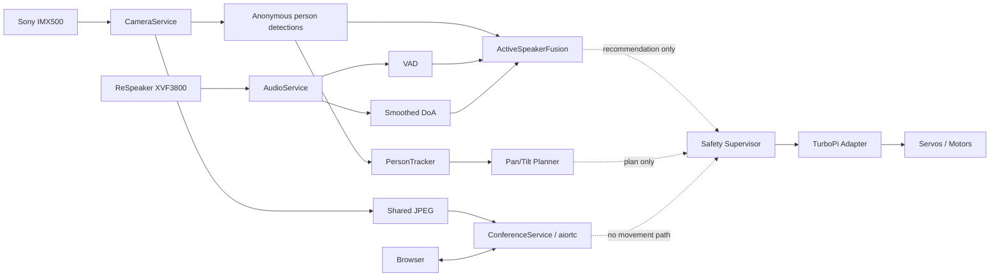

# ZeeAIBotWebCam

**Affordable AI-Powered Robotic Video Conferencing System Using Raspberry Pi and Python for Hybrid Active Learning Classrooms**

ZeeAIBotWebCam is a production-oriented research and teaching platform built around **Hiwonder TurboPi + Raspberry Pi + Sony IMX500 AI Camera + ReSpeaker XVF3800 + Python + Edge AI + WebRTC**.

The software now includes the hardware safety boundary, single-owner camera and audio metadata services, anonymous person tracking, plan-only pan/tilt control, ReSpeaker VAD/DoA, active-speaker fusion, and the first WebRTC telepresence transport. Physical robot motion remains intentionally locked until calibration is complete.

## Project status

| Phase | Scope | Status |
|---|---|---|
| Phase 0 | Engineering analysis and architecture | ✅ Documented |
| Phase 1 | Development environment and software foundation | ✅ Implemented |
| Phase 2 | Physical hardware validation | 🧪 Baseline validated; calibration follow-ups remain |
| Phase 3 | TurboPi hardware adapter + safety supervisor | ✅ Implemented |
| Phase 4 | Sony IMX500 camera service + person detection | ✅ Implemented; real Pi validation required |
| Phase 5 | Anonymous person tracking and lost-target handling | ✅ Implemented |
| Phase 6 | Bounded pan/tilt tracking planner | ✅ Implemented in plan-only mode |
| Phase 7 | ReSpeaker XVF3800 VAD + DoA service | ✅ Implemented; real hardware validation required |
| Phase 8 | Vision + audio active-speaker fusion | ✅ Implemented; geometry calibration required |
| Phase 9 | WebRTC telepresence session + video transport | ✅ Implemented; real LAN validation required |
| Phase 10+ | Conference UI, remote audio, authentication, production hardening | ⏳ Planned |

## Safety baseline

> **AI, web, camera, tracking, audio, fusion, and conferencing modules never command motors directly.**
>
> All future physical movement must pass through the central Safety Supervisor and verified hardware adapters.

The committed configuration remains safe:

```yaml
hardware:
  mode: mock
  motor_mapping_validated: false
  pan_tilt:
    enabled: false

camera:
  mode: mock

pan_tilt_control:
  mode: plan_only

audio:
  mode: mock
  orientation_calibrated: false

active_speaker:
  geometry_calibrated: false

conference:
  mode: mock
  publish_video: true
  publish_audio: false

safety:
  motion_enabled: false
```

## Current architecture



## Repository layout

```text
ZeeAIBotWebCam/
├── config.yaml
├── pyproject.toml
├── src/robotic_classroom/
│   ├── audio/
│   ├── camera/
│   ├── conference/
│   ├── control/
│   ├── core/
│   ├── fusion/
│   ├── hardware/
│   ├── pan_tilt/
│   ├── safety/
│   ├── tracking/
│   └── web/
├── tests/
├── scripts/
├── vendor/
└── docs/
```

## Phase documentation

- [`docs/phase-00-engineering-analysis.md`](docs/phase-00-engineering-analysis.md)
- [`docs/phase-01-development-environment.md`](docs/phase-01-development-environment.md)
- [`docs/phase-02-hardware-validation.md`](docs/phase-02-hardware-validation.md)
- [`docs/phase-03-hardware-adapter-safety.md`](docs/phase-03-hardware-adapter-safety.md)
- [`docs/phase-04-imx500-camera-service.md`](docs/phase-04-imx500-camera-service.md)
- [`docs/phase-05-person-tracking.md`](docs/phase-05-person-tracking.md)
- [`docs/phase-06-pan-tilt-planning.md`](docs/phase-06-pan-tilt-planning.md)
- [`docs/phase-07-respeaker-audio-service.md`](docs/phase-07-respeaker-audio-service.md)
- [`docs/phase-08-active-speaker-fusion.md`](docs/phase-08-active-speaker-fusion.md)
- [`docs/phase-09-webrtc-telepresence.md`](docs/phase-09-webrtc-telepresence.md)
- [`docs/hardware-api-inventory.md`](docs/hardware-api-inventory.md)
- [`docs/architecture.md`](docs/architecture.md)
- [`docs/safety.md`](docs/safety.md)

## Pull latest code on Raspberry Pi

```bash
cd ~/ZeeAIBotWebCam
git pull
source .venv/bin/activate
pip install -e ".[dev]"
ruff check src tests
pytest -v
```

## Run everything in mock mode

```bash
export HARDWARE_MODE=mock
export CAMERA_MODE=mock
export AUDIO_MODE=mock
export CONFERENCE_MODE=mock
export TRACKING_ENABLED=true
export PAN_TILT_CONTROL_ENABLED=true
export ACTIVE_SPEAKER_ENABLED=true
export ACTIVE_SPEAKER_GEOMETRY_CALIBRATED=false
python -m robotic_classroom.main
```

Useful endpoints:

```text
GET    /health
GET    /ready
GET    /api/sensors
GET    /api/camera/status
GET    /api/camera/detections
GET    /api/camera/frame.jpg
GET    /api/tracking/status
GET    /api/pan-tilt/plan
GET    /api/audio/status
GET    /api/active-speaker/status
GET    /api/conference/status
POST   /api/conference/offer
DELETE /api/conference/sessions/{session_id}
GET    /conference
GET    /api/safety
```

There is deliberately **no public robot movement endpoint**.

## Test the real IMX500 while robot movement stays mocked

```bash
export HARDWARE_MODE=mock
export CAMERA_MODE=imx500
export AUDIO_MODE=mock
python -m robotic_classroom.main
```

Open:

```text
http://localhost:8000/api/camera/status
http://localhost:8000/api/camera/detections
http://localhost:8000/api/tracking/status
http://localhost:8000/api/pan-tilt/plan
http://localhost:8000/api/camera/frame.jpg
```

## Test the ReSpeaker XVF3800

```bash
lsusb
arecord -l
python scripts/phase7_audio_check.py
```

Expected USB VID/PID:

```text
2886:001a
```

Then:

```bash
export HARDWARE_MODE=mock
export CAMERA_MODE=mock
export AUDIO_MODE=xvf3800_usb
python -m robotic_classroom.main
```

Open:

```text
http://localhost:8000/api/audio/status
```

## Phase 8 — active-speaker fusion

The fusion layer will not geometrically use DoA until both calibration gates are true:

```yaml
audio:
  orientation_calibrated: true

active_speaker:
  geometry_calibrated: true
```

Until then the active-speaker API safely reports a calibration-required state and always returns:

```json
"movement_requested": false
```

## Phase 9 — WebRTC telepresence

Phase 9 adds mock and real conference backends.

### Mock signaling/API test

```bash
export CONFERENCE_MODE=mock
python -m robotic_classroom.main
```

Open:

```text
http://localhost:8000/api/conference/status
http://localhost:8000/conference
```

Mock SDP validates API/session lifecycle but is not a real browser media connection.

### Real Raspberry Pi LAN video test

Install optional WebRTC dependencies:

```bash
pip install -e ".[dev,webrtc]"
```

Then run the real IMX500 with robot movement still mocked:

```bash
export HARDWARE_MODE=mock
export CAMERA_MODE=imx500
export AUDIO_MODE=mock
export CONFERENCE_MODE=aiortc
export CONFERENCE_PUBLISH_AUDIO=false
python -m robotic_classroom.main
```

Open through VS Code port forwarding or a trusted LAN:

```text
http://localhost:8000/conference
```

Click **Connect**. The real WebRTC backend publishes the existing `CameraService` stream; it does not open a second Picamera2 instance.

Raw Raspberry Pi microphone publishing remains disabled until the actual ReSpeaker ALSA capture device is verified. After that it can be enabled with `CONFERENCE_PUBLISH_AUDIO=true` and the measured ALSA input identifier.

## Privacy baseline

The design defaults to:

- no face recognition;
- no voice recognition;
- no biometric identity database;
- no recording;
- no cloud upload of raw classroom video by default;
- anonymous on-device person detection;
- temporary labels such as `Person-01` and `Speaker-01` only;
- physical movement disabled by default;
- live conference media only when a WebRTC session is explicitly established.

## Upstream references

Hiwonder TurboPi:

https://github.com/Hiwonder/TurboPi

Raspberry Pi Picamera2 / IMX500:

https://github.com/raspberrypi/picamera2

Seeed Studio ReSpeaker XVF3800 Python control:

https://wiki.seeedstudio.com/respeaker_xvf3800_python_sdk/

aiortc:

https://github.com/aiortc/aiortc

## Next phase

**Phase 10** should add the operator/conference UI, authenticated session lifecycle, remote speaker-output validation, camera/microphone indicators, deployment/TLS boundaries, and observability. Real active-speaker servo execution and remote driving should remain blocked until the physical servo, microphone orientation, motor mapping, and safety-calibration gates are complete.
