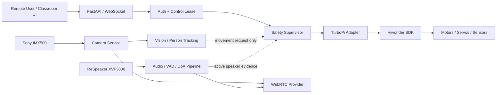

# ZeeAIBotWebCam

**Affordable AI-Powered Robotic Video Conferencing System Using Raspberry Pi and Python for Hybrid Active Learning Classrooms**

ZeeAIBotWebCam is a production-oriented research and teaching platform built around **Hiwonder TurboPi + Raspberry Pi + Sony IMX500 AI Camera + Python + Edge AI + WebRTC**.

The repository follows a phased engineering process. The first phases establish the verified architecture, a safe software foundation, and physical hardware validation before any autonomous or remote movement is enabled.

## Project status

| Phase | Scope | Status |
|---|---|---|
| Phase 0 | Engineering analysis and architecture | ✅ Documented |
| Phase 1 | Development environment and software foundation | ✅ Implemented |
| Phase 2 | Physical hardware validation | 🧪 Validation tooling generated; physical tests required |
| Phase 3 | TurboPi production hardware adapter + safety supervisor | ⏳ Planned |
| Phase 4 | Sony IMX500 AI Camera integration | ⏳ Planned |
| Phase 5+ | Camera service, telepresence, tracking, WebRTC, active-speaker AI, hardening | ⏳ Planned |

## Confirmed physical hardware for Phase 2

Based on the current assembled robot and owned peripherals, Phase 2 targets:

- four-wheel Hiwonder TurboPi Mecanum chassis;
- Hiwonder controller/expansion electronics;
- dual-18650 battery holder;
- front Hiwonder ultrasonic distance sensor;
- four-channel Hiwonder IR line sensor;
- two-axis pan/tilt camera mount;
- Raspberry Pi AI Camera using the Sony IMX500;
- Seeed Studio ReSpeaker XVF3800 USB 4-Mic Array;
- external speaker/audio output.

The AI Camera must still be physically mounted and its ribbon orientation verified before camera testing.

## Core safety rule

> **AI, web, vision and conference modules must never command motors directly.**
>
> All future chassis or pan/tilt movement must pass through a centralized safety controller and a verified TurboPi hardware adapter.

The application therefore still defaults to:

```yaml
hardware:
  mode: mock

safety:
  motion_enabled: false
```

Phase 2 motor/servo checks are separate bench-test scripts, require an explicit `--confirm-motion` option, limit duty/range, and never expose movement through the web API.

## Architecture at a glance



## Repository layout

```text
ZeeAIBotWebCam/
├── config.yaml
├── pyproject.toml
├── src/robotic_classroom/
│   ├── core/
│   ├── hardware/
│   └── web/
├── tests/
├── scripts/
│   ├── bootstrap_pi.sh
│   ├── environment_report.sh
│   ├── phase2_readonly_check.py
│   └── phase2_actuator_test.py
├── vendor/
└── docs/
```

## Phase documentation

- [`docs/phase-00-engineering-analysis.md`](docs/phase-00-engineering-analysis.md)
- [`docs/phase-01-development-environment.md`](docs/phase-01-development-environment.md)
- [`docs/phase-02-hardware-validation.md`](docs/phase-02-hardware-validation.md)
- [`docs/hardware-api-inventory.md`](docs/hardware-api-inventory.md)
- [`docs/architecture.md`](docs/architecture.md)
- [`docs/safety.md`](docs/safety.md)

## Quick start — mock mode

### Linux / Raspberry Pi

```bash
python3 -m venv .venv
source .venv/bin/activate
python -m pip install --upgrade pip
pip install -e ".[dev]"
python -m robotic_classroom.main
```

### Windows PowerShell

```powershell
py -m venv .venv
.\.venv\Scripts\Activate.ps1
python -m pip install --upgrade pip
pip install -e ".[dev]"
$env:HARDWARE_MODE="mock"
python -m robotic_classroom.main
```

Open:

- `http://127.0.0.1:8000/health`
- `http://127.0.0.1:8000/ready`
- `http://127.0.0.1:8000/docs`

Run tests:

```bash
pytest -v
```

## Raspberry Pi setup

Use the bootstrap helper only after reviewing it:

```bash
chmod +x scripts/bootstrap_pi.sh
./scripts/bootstrap_pi.sh
```

The Hiwonder repository is treated as external vendor software and is cloned to `vendor/TurboPi` by the bootstrap script. The upstream SDK is not duplicated or rewritten inside this application.

## Phase 2 — start with read-only checks

After physically checking wiring and power:

```bash
source .venv/bin/activate
python scripts/phase2_readonly_check.py --system
python scripts/phase2_readonly_check.py --i2c
python scripts/phase2_readonly_check.py --audio
```

Then explicitly validate the Hiwonder controller and sensors:

```bash
python scripts/phase2_readonly_check.py --controller
python scripts/phase2_readonly_check.py --sonar
python scripts/phase2_readonly_check.py --ir
```

Read the complete Phase 2 procedure before any actuator test:

[`docs/phase-02-hardware-validation.md`](docs/phase-02-hardware-validation.md)

## Upstream hardware SDK

Hiwonder TurboPi:

https://github.com/Hiwonder/TurboPi

Phase 0 verified the real vendor APIs before designing this project. See the hardware inventory document for the exact API names currently relied upon.

## Privacy baseline

The initial design defaults to:

- no face recognition;
- no biometric identity database;
- no recording;
- no cloud upload of raw classroom video by default;
- on-device person detection/tracking where practical;
- explicit indicators for camera, microphone and conference state.

## Current limitation

Phase 2 tooling does not prove the hardware by itself. Raspberry Pi model, OS version, controller communication, battery telemetry, sensor mapping, motor directions, servo limits, IMX500 operation, ReSpeaker input and speaker output must be verified on the actual robot and recorded before Phase 3 begins.
