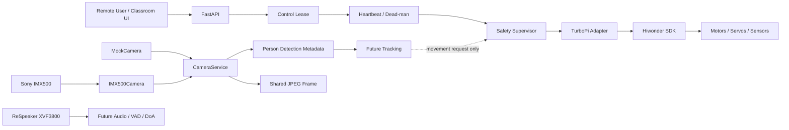

# ZeeAIBotWebCam

**Affordable AI-Powered Robotic Video Conferencing System Using Raspberry Pi and Python for Hybrid Active Learning Classrooms**

ZeeAIBotWebCam is a production-oriented research and teaching platform built around **Hiwonder TurboPi + Raspberry Pi + Sony IMX500 AI Camera + Python + Edge AI + WebRTC**.

The repository follows a phased engineering process. The current software now includes the production hardware boundary, central safety layer, and a single-owner Sony IMX500 camera service. Real chassis movement remains intentionally locked until physical calibration is complete.

## Project status

| Phase | Scope | Status |
|---|---|---|
| Phase 0 | Engineering analysis and architecture | ✅ Documented |
| Phase 1 | Development environment and software foundation | ✅ Implemented |
| Phase 2 | Physical hardware validation | 🧪 Baseline validated; calibration follow-ups remain |
| Phase 3 | TurboPi production hardware adapter + safety supervisor | ✅ Phase 3A/3B implemented |
| Phase 4 | Sony IMX500 AI Camera service + person-detection metadata | ✅ Implemented; real Pi validation required |
| Phase 5 | Person tracking, smoothing and lost-target handling | ⏳ Next |
| Phase 6+ | ReSpeaker fusion, WebRTC, active-speaker AI, hardening | ⏳ Planned |

## Current validated hardware baseline

The project has already verified enough real hardware to continue software development:

- Raspberry Pi Remote SSH development;
- project runtime on Raspberry Pi;
- Hiwonder UART on `/dev/ttyAMA0`;
- Hiwonder controller communication;
- I2C bus availability;
- ultrasonic sensor discovery;
- Sony IMX500 AI Camera detection and still capture;
- servo power rail around 4.7–4.97 V;
- at least one PWM servo physically moving.

Open Phase 2 calibration items remain:

- identify and calibrate both pan/tilt servo channels;
- map the four IR channels to physical positions;
- validate ReSpeaker XVF3800 capture/DoA path;
- validate speaker output;
- map all four motor IDs and polarity;
- resolve battery telemetry interpretation before chassis movement.

## Core safety rule

> **AI, web, vision and conference modules must never command motors directly.**
>
> All chassis or pan/tilt movement must pass through the central Safety Supervisor and the TurboPi hardware adapter.

The application defaults to:

```yaml
hardware:
  mode: mock
  motor_mapping_validated: false
  pan_tilt:
    enabled: false

camera:
  mode: mock

safety:
  motion_enabled: false
```

So normal application startup cannot drive the robot.

## Current architecture



## Repository layout

```text
ZeeAIBotWebCam/
├── config.yaml
├── pyproject.toml
├── src/robotic_classroom/
│   ├── camera/
│   ├── core/
│   ├── control/
│   ├── hardware/
│   ├── safety/
│   └── web/
├── tests/
├── scripts/
├── vendor/
└── docs/
```

## Phase documentation

- [`docs/phase-00-engineering-analysis.md`](docs/phase-00-engineering-analysis.md)
- [`docs/phase-01-development-environment.md`](docs/phase-01-development-environment.md)
- [`docs/phase-02-hardware-validation.md`](docs/phase-02-hardware-validation.md)
- [`docs/phase-03-hardware-adapter-safety.md`](docs/phase-03-hardware-adapter-safety.md)
- [`docs/phase-04-imx500-camera-service.md`](docs/phase-04-imx500-camera-service.md)
- [`docs/hardware-api-inventory.md`](docs/hardware-api-inventory.md)
- [`docs/architecture.md`](docs/architecture.md)
- [`docs/safety.md`](docs/safety.md)

## Pull latest code on Raspberry Pi

```bash
cd ~/ZeeAIBotWebCam
git pull
source .venv/bin/activate
pip install -e ".[dev]"
pytest -v
```

## Run in fully mocked development mode

```bash
export HARDWARE_MODE=mock
export CAMERA_MODE=mock
python -m robotic_classroom.main
```

Open:

- `http://127.0.0.1:8000/health`
- `http://127.0.0.1:8000/ready`
- `http://127.0.0.1:8000/api/sensors`
- `http://127.0.0.1:8000/api/safety`
- `http://127.0.0.1:8000/api/camera/status`
- `http://127.0.0.1:8000/api/camera/detections`
- `http://127.0.0.1:8000/docs`

The mock camera deliberately does not generate a JPEG; `/api/camera/frame.jpg` returns 503 in mock mode.

## Test the real Sony IMX500 while keeping robot motion mocked

First confirm the model exists:

```bash
ls -lh /usr/share/imx500-models/imx500_network_ssd_mobilenetv2_fpnlite_320x320_pp.rpk
```

Then run:

```bash
export HARDWARE_MODE=mock
export CAMERA_MODE=imx500
python -m robotic_classroom.main
```

This combination is intentional: it tests the real AI Camera while keeping TurboPi movement isolated.

With VS Code Remote SSH, forward port `8000` and open on Windows:

```text
http://localhost:8000/api/camera/status
http://localhost:8000/api/camera/detections
http://localhost:8000/api/camera/frame.jpg
http://localhost:8000/docs
```

Stand in front of the camera and refresh the detections endpoint. A successful response contains anonymous `person` detections with confidence and bounding-box coordinates. No face recognition or identity database is used.

## Safe API surface

```text
GET  /health
GET  /ready
GET  /api/sensors
GET  /api/safety
GET  /api/camera/status
GET  /api/camera/detections
GET  /api/camera/frame.jpg
POST /api/control/lease
POST /api/control/heartbeat
POST /api/control/emergency-stop
POST /api/control/reset-stop
```

There is deliberately **no public movement endpoint** yet.

## Upstream hardware and camera software

Hiwonder TurboPi:

https://github.com/Hiwonder/TurboPi

Raspberry Pi Picamera2 / IMX500 support:

https://github.com/raspberrypi/picamera2

The project keeps vendor-specific behavior behind adapters and services rather than allowing application modules to open hardware directly.

## Privacy baseline

The design defaults to:

- no face recognition;
- no biometric identity database;
- no recording;
- no cloud upload of raw classroom video by default;
- anonymous on-device person detection;
- explicit camera service state;
- future camera/microphone/conference indicators.

## Next phase

**Phase 5** will build on the Phase 4 detection metadata to add:

- target selection when several people are visible;
- stable temporary person tracking;
- bounding-box centre/error calculations;
- temporal smoothing and hysteresis;
- lost-target handling;
- tracking requests that remain separated from direct servo/motor control.
