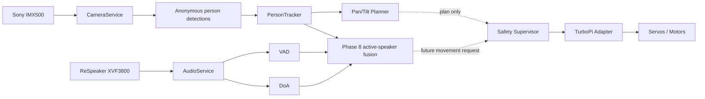

# ZeeAIBotWebCam

**Affordable AI-Powered Robotic Video Conferencing System Using Raspberry Pi and Python for Hybrid Active Learning Classrooms**

ZeeAIBotWebCam is a production-oriented research and teaching platform built around **Hiwonder TurboPi + Raspberry Pi + Sony IMX500 AI Camera + ReSpeaker XVF3800 + Python + Edge AI + WebRTC**.

The repository follows a phased engineering process. The current software includes the production hardware boundary, central safety layer, single-owner Sony IMX500 camera service, anonymous person tracking, plan-only pan/tilt control, and a ReSpeaker VAD/DoA metadata service. Real robot movement remains intentionally locked until physical calibration is complete.

## Project status

| Phase | Scope | Status |
|---|---|---|
| Phase 0 | Engineering analysis and architecture | ✅ Documented |
| Phase 1 | Development environment and software foundation | ✅ Implemented |
| Phase 2 | Physical hardware validation | 🧪 Baseline validated; calibration follow-ups remain |
| Phase 3 | TurboPi production hardware adapter + safety supervisor | ✅ Implemented |
| Phase 4 | Sony IMX500 camera service + person detection | ✅ Implemented; real Pi validation required |
| Phase 5 | Anonymous person tracking and lost-target handling | ✅ Implemented |
| Phase 6 | Bounded pan/tilt tracking planner | ✅ Implemented in plan-only mode |
| Phase 7 | ReSpeaker XVF3800 VAD + DoA service | ✅ Implemented; real hardware validation required |
| Phase 8 | Vision + audio active-speaker fusion | ⏳ Next |
| Phase 9+ | WebRTC, remote control, production hardening | ⏳ Planned |

## Safety baseline

> **AI, web, camera, tracking and audio modules never command motors directly.**
>
> All future physical movement must pass through the central Safety Supervisor and verified hardware adapters.

The committed configuration therefore remains safe:

```yaml
hardware:
  mode: mock
  motor_mapping_validated: false
  pan_tilt:
    enabled: false

camera:
  mode: mock

pan_tilt_control:
  mode: plan_only

audio:
  mode: mock

safety:
  motion_enabled: false
```

## Current architecture



## Repository layout

```text
ZeeAIBotWebCam/
├── config.yaml
├── pyproject.toml
├── src/robotic_classroom/
│   ├── audio/
│   ├── camera/
│   ├── control/
│   ├── core/
│   ├── hardware/
│   ├── pan_tilt/
│   ├── safety/
│   ├── tracking/
│   └── web/
├── tests/
├── scripts/
├── vendor/
└── docs/
```

## Phase documentation

- [`docs/phase-00-engineering-analysis.md`](docs/phase-00-engineering-analysis.md)
- [`docs/phase-01-development-environment.md`](docs/phase-01-development-environment.md)
- [`docs/phase-02-hardware-validation.md`](docs/phase-02-hardware-validation.md)
- [`docs/phase-03-hardware-adapter-safety.md`](docs/phase-03-hardware-adapter-safety.md)
- [`docs/phase-04-imx500-camera-service.md`](docs/phase-04-imx500-camera-service.md)
- [`docs/phase-05-person-tracking.md`](docs/phase-05-person-tracking.md)
- [`docs/phase-06-pan-tilt-planning.md`](docs/phase-06-pan-tilt-planning.md)
- [`docs/phase-07-respeaker-audio-service.md`](docs/phase-07-respeaker-audio-service.md)
- [`docs/hardware-api-inventory.md`](docs/hardware-api-inventory.md)
- [`docs/architecture.md`](docs/architecture.md)
- [`docs/safety.md`](docs/safety.md)

## Pull latest code on Raspberry Pi

```bash
cd ~/ZeeAIBotWebCam
git pull
source .venv/bin/activate
pip install -e ".[dev]"
ruff check src tests
pytest -v
```

## Run everything in mock mode

```bash
export HARDWARE_MODE=mock
export CAMERA_MODE=mock
export AUDIO_MODE=mock
export TRACKING_ENABLED=true
export PAN_TILT_CONTROL_ENABLED=true
python -m robotic_classroom.main
```

Useful endpoints:

```text
GET /health
GET /ready
GET /api/sensors
GET /api/camera/status
GET /api/camera/detections
GET /api/camera/frame.jpg
GET /api/tracking/status
GET /api/pan-tilt/plan
GET /api/audio/status
GET /api/safety
```

There is deliberately **no public robot movement endpoint** yet.

## Test the real IMX500 while robot movement stays mocked

```bash
export HARDWARE_MODE=mock
export CAMERA_MODE=imx500
export AUDIO_MODE=mock
python -m robotic_classroom.main
```

Then open:

```text
http://localhost:8000/api/camera/status
http://localhost:8000/api/camera/detections
http://localhost:8000/api/tracking/status
http://localhost:8000/api/pan-tilt/plan
http://localhost:8000/api/camera/frame.jpg
```

## Phase 7 — test the ReSpeaker XVF3800

First validate the physical device independently:

```bash
lsusb
arecord -l
python scripts/phase7_audio_check.py
```

For USB control, the expected XVF3800 VID/PID is:

```text
2886:001a
```

Then run the application with real microphone metadata while all robot hardware and vision remain mocked:

```bash
export HARDWARE_MODE=mock
export CAMERA_MODE=mock
export AUDIO_MODE=xvf3800_usb
python -m robotic_classroom.main
```

Open:

```text
http://localhost:8000/api/audio/status
```

A successful real-device response reports:

- firmware version;
- VAD speech state;
- raw 0–359° direction of arrival;
- smoothed/calibrated direction field;
- whether physical microphone orientation has been calibrated.

The orientation remains deliberately marked uncalibrated until the relationship between the microphone-array 0° direction and the robot's physical front has been measured.

## Privacy baseline

The design defaults to:

- no face recognition;
- no biometric identity database;
- no recording;
- no cloud upload of raw classroom video by default;
- anonymous on-device person detection;
- temporary labels such as `Person-01` only;
- VAD/DoA metadata used without speaker identity;
- physical movement disabled by default.

## Upstream references

Hiwonder TurboPi:

https://github.com/Hiwonder/TurboPi

Raspberry Pi Picamera2 / IMX500:

https://github.com/raspberrypi/picamera2

Seeed Studio ReSpeaker XVF3800 Python control:

https://wiki.seeedstudio.com/respeaker_xvf3800_python_sdk/

## Next phase

**Phase 8** will combine anonymous camera tracking with ReSpeaker VAD/DoA evidence to choose the most likely active speaker. It will remain a decision/planning layer first: audio will not be allowed to bypass the Safety Supervisor or directly move the robot.
