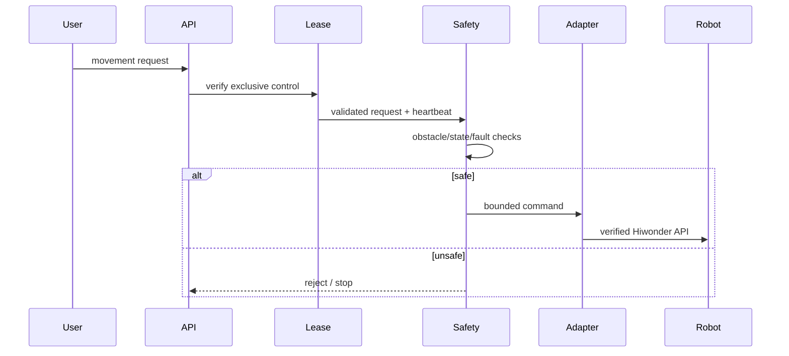
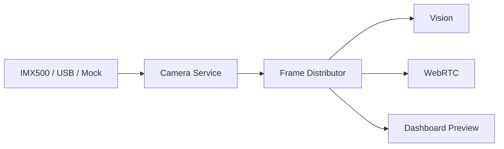

# ZeeAIBotWebCam Architecture

## Architectural principles

1. One owner for each physical hardware resource.
2. AI never commands motors directly.
3. Web/API code never imports vendor motor APIs.
4. All movement goes through a centralized Safety Supervisor.
5. Camera capture has a single owner and distributes frames to consumers.
6. Conference/media transport is separated from robot control.
7. Mock implementations exist for hardware-dependent subsystems.
8. Configuration and calibration values are externalized.
9. Hardware faults and stale sensor data fail safe.
10. Privacy-sensitive capabilities are disabled by default.

## Target module boundaries

```text
robotic_classroom/
├── core/          configuration, state, logging
├── hardware/      hardware interfaces and TurboPi adapter
├── safety/        safety supervisor, control lease, watchdogs
├── camera/        IMX500, USB fallback, frame distribution
├── vision/        person/pose tracking
├── audio/         capture, VAD, optional DOA, AEC/noise processing
├── intelligence/  active-speaker fusion and high-level decisions
├── conference/    WebRTC provider abstraction
├── web/           FastAPI, WebSocket and dashboard
├── security/      authentication/RBAC/token handling
└── telemetry/     health, metrics and diagnostics
```

Only Phase 1 modules are implemented today. The remaining directories describe the production boundaries that later phases must follow.

## Control flow



## Camera flow



No consumer independently opens the same physical camera.

## Autonomous decision flow

```text
Vision/Audio inference
        |
        v
High-level tracking decision
        |
        v
MovementRequest
        |
        v
Safety Supervisor
        |
        +---- unsafe ---> reject/stop
        |
        v
TurboPiAdapter
        |
        v
Hiwonder SDK
```

This separation allows AI components to be replaced without changing the safety contract.
