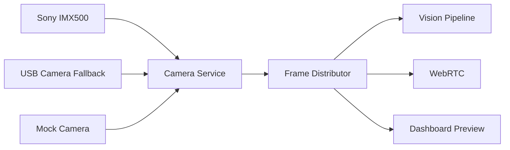
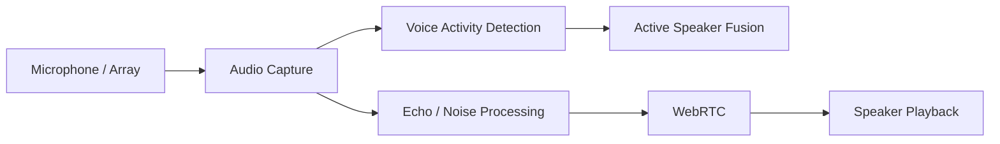
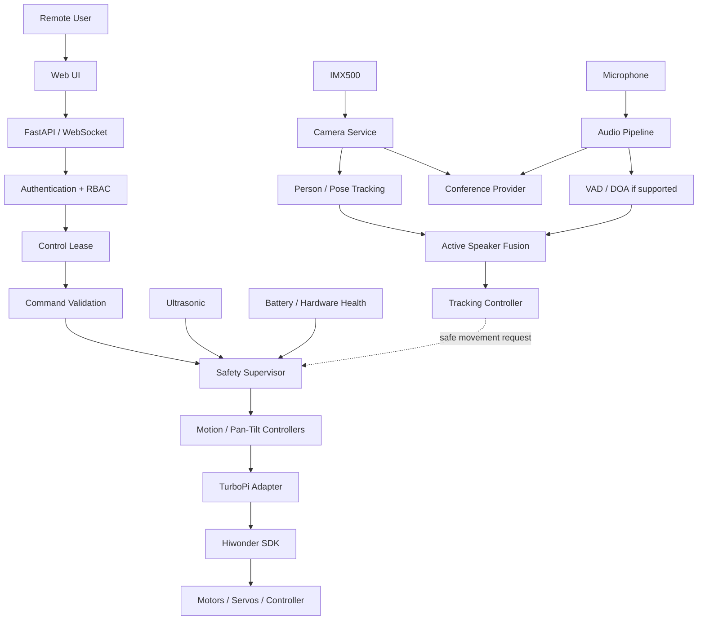

# Phase 0 — Engineering Analysis

## 1. Objective

Establish a verified architecture for an affordable AI-powered robotic video conferencing system using Hiwonder TurboPi, Raspberry Pi, Sony IMX500 AI Camera, Python, edge AI and WebRTC.

The defining rule is that vendor hardware APIs must be inspected before use and that AI or web components must never control motors directly.

## 2. Verified upstream architecture

The Hiwonder TurboPi repository is organized around:

- `TurboPi.py` as the top-level orchestrator;
- `HiwonderSDK/ros_robot_controller_sdk.py` for controller-board communication;
- `HiwonderSDK/mecanum.py` for Mecanum chassis control;
- `HiwonderSDK/Sonar.py` for ultrasonic sensing;
- `Camera.py` for the legacy USB camera;
- `MjpgServer.py` for MJPEG streaming;
- `RPCServer.py` for JSON-RPC control;
- `Functions/` for educational computer-vision and behavior examples.

The existing code uses global/shared state and several modules directly command motors or servos. That architecture is useful as a reference implementation but is not suitable as the public control plane for a safety-oriented classroom telepresence robot.

## 3. Verified Hiwonder API inventory

The following upstream APIs were verified before this repository was designed:

| Capability | Verified API |
|---|---|
| Controller board | `HiwonderSDK.ros_robot_controller_sdk.Board()` |
| Enable board reception | `board.enable_reception()` |
| Battery | `board.get_battery()` |
| Individual motors | `board.set_motor_duty(...)` |
| PWM servos | `board.pwm_servo_set_position(duration, positions)` |
| RGB | `board.set_rgb(...)` |
| Buzzer | `board.set_buzzer(freq, on_time, off_time, repeat)` |
| Mecanum chassis | `HiwonderSDK.mecanum.MecanumChassis()` |
| Chassis velocity | `car.set_velocity(velocity, direction, angular_rate)` |
| Translation | `car.translation(velocity_x, velocity_y)` |
| Ultrasonic | `HiwonderSDK.Sonar.Sonar().getDistance()` |

No unverified Hiwonder method name should be introduced into production code.

## 4. Vendor reuse strategy

### Reuse and wrap

- `HiwonderSDK/ros_robot_controller_sdk.py`
- `HiwonderSDK/mecanum.py`
- `HiwonderSDK/Sonar.py`
- selected helper algorithms such as PID where useful

### Reference only / replace architecture

- `TurboPi.py`
- `RPCServer.py`
- `MjpgServer.py`
- `Functions/FaceTracking.py`
- `Functions/Avoidance.py`
- `Functions/Running.py`

The new codebase uses a `TurboPiAdapter` boundary in later phases rather than allowing application modules to import vendor motor APIs freely.

## 5. Camera architecture

Use one camera owner and a frame-distribution design:



Planned camera interface implementations:

- `IMX500Camera` — production primary camera;
- `USBCamera` — optional legacy/fallback camera;
- `MockCamera` — CI/development backend.

The legacy `Camera.py` is not the primary IMX500 implementation.

## 6. Vision and tracking

Initial progression:

1. person detection;
2. stable track IDs;
3. pose/keypoint support if required;
4. active-speaker fusion;
5. pan/tilt tracking;
6. chassis repositioning only through the Safety Supervisor.

Vision may submit a movement request but must never issue a hardware command.

## 7. Audio architecture



A normal microphone should support VAD. Direction of arrival is enabled only when the installed microphone array genuinely supports it.

## 8. WebRTC architecture

Use a `ConferenceProvider` abstraction.

Recommended production direction:

- LiveKit for production SFU/WebRTC deployment;
- aiortc for Python-native prototypes and testing;
- mock provider for CI.

Robot motion/control must remain separate from conference signaling/media.

## 9. System architecture



## 10. Safety architecture

Safety priority is centralized and deterministic.

Highest-priority conditions include:

1. physical emergency stop;
2. hardware/controller fault;
3. obstacle danger;
4. control-heartbeat/network loss;
5. invalid system state;
6. manual authorized control;
7. autonomous movement request;
8. visual tracking request.

A lost control heartbeat must cause a fail-safe stop. The initial target for a motion dead-man timeout is approximately 500–750 ms and must remain configurable and hardware-tested.

## 11. Privacy baseline

Default posture:

- face recognition: disabled;
- biometric identity database: none;
- recording: disabled;
- persistent person identity: none;
- cloud upload of raw video: disabled by default;
- on-device inference where practical;
- visible camera/microphone/conference indicators.

Temporary labels such as `Person-01` may be used only for session-local tracking.

## 12. Security baseline

Do not expose legacy JSON-RPC directly to the public network.

Target control path:

```text
TLS -> FastAPI -> Authentication/RBAC -> Control Lease
    -> Command Validation -> Safety Supervisor -> TurboPi Adapter
```

Candidate roles:

- `ADMIN`
- `TEACHER`
- `REMOTE_PARTICIPANT`
- `VIEWER`

Movement requires authentication, permission, an active lease, a fresh heartbeat and a safe robot state.

## 13. Major engineering risks

| Risk | Mitigation |
|---|---|
| Hiwonder SDK compatibility with current Raspberry Pi OS | Validate before enabling real mode |
| Vendor imports opening serial hardware immediately | Lazy import real backend |
| Servo miscalibration | Configurable limits + Phase 2 calibration |
| Collision | Central safety supervisor + ultrasonic freshness |
| Lost network | Dead-man timeout / stop |
| Multiple controllers | Exclusive control lease |
| TURN/firewall WebRTC failures | Production TURN/SFU deployment |
| CPU/GPU/NPU load | Measure latency and resource use |
| Brownout/power instability | Battery and power monitoring |
| Privacy/GDPR | Minimize stored personal data and recording |

## 14. Phase roadmap

- Phase 0 — engineering analysis
- Phase 1 — environment and repository foundation
- Phase 2 — physical hardware validation
- Phase 3 — production TurboPi adapter and safety layer
- Phase 4 — Sony IMX500 integration
- Phase 5 — camera service/frame distribution
- Phase 6 — audio pipeline
- Phase 7 — secure web control/dashboard
- Phase 8 — WebRTC provider
- Phase 9 — person tracking
- Phase 10 — active speaker fusion
- Phase 11 — pan/tilt tracking
- Phase 12 — safe chassis repositioning
- Phase 13 — observability and diagnostics
- Phase 14 — privacy/security hardening
- Phase 15 — deployment/systemd
- Phase 16 — validation, classroom trials and production hardening

## 15. Phase 0 definition of done

Phase 0 is complete when the architecture, vendor API inventory, camera/audio/WebRTC approach, privacy baseline, safety model, risk register and phased roadmap are documented without inventing hardware APIs.

Physical facts remain intentionally unverified until Phase 2.
