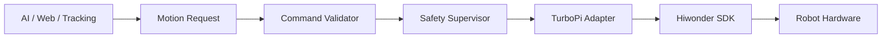

# Phase 3 — TurboPi Hardware Adapter and Safety Supervisor

Phase 3 introduces the production boundary between application logic and the Hiwonder TurboPi SDK.

## Status

- Hardware adapter architecture: implemented
- Mock backend: implemented
- Real sensor access: implemented
- Safety supervisor: implemented
- Emergency stop: implemented
- Dead-man heartbeat: implemented
- Control lease: implemented
- Pan/tilt configuration: implemented but disabled until calibration is complete
- Chassis movement: intentionally locked until motor mapping is validated

## Core rule

> AI, web, vision and conference code must never call Hiwonder motor APIs directly.

All movement requests must follow:



## Production adapter

`src/robotic_classroom/hardware/turbopi_adapter.py` wraps verified upstream APIs and keeps Hiwonder imports lazy.

It currently supports:

- controller lifecycle;
- battery telemetry;
- ultrasonic distance sensing;
- four-channel infrared sensing;
- calibrated pan/tilt PWM commands;
- guaranteed all-motor stop.

Chassis movement remains locked until `motor_mapping_validated: true` and a later calibrated motor implementation are both present.

## Safety supervisor

`SafetySupervisor` enforces:

1. global `motion_enabled` gate;
2. robot state;
3. numeric command bounds;
4. control lease;
5. fresh dead-man heartbeat;
6. ultrasonic obstacle blocking for forward movement;
7. emergency stop.

A rejected non-stop movement request causes `stop_motion()` to be issued.

## Safe defaults

```yaml
hardware:
  motor_mapping_validated: false
  pan_tilt:
    enabled: false

safety:
  motion_enabled: false
  minimum_obstacle_distance_cm: 30.0
  heartbeat_timeout_ms: 750
  control_lease_ttl_seconds: 10.0
  require_control_lease: true
```

These defaults make accidental movement impossible through the normal application path.

## New safe APIs

The FastAPI service exposes only non-driving Phase 3 control endpoints:

- `GET /health`
- `GET /ready`
- `GET /api/sensors`
- `GET /api/safety`
- `POST /api/control/lease`
- `POST /api/control/heartbeat`
- `POST /api/control/emergency-stop`
- `POST /api/control/reset-stop`

There is deliberately no public chassis movement endpoint yet.

## Current hardware baseline

Validated sufficiently to continue development:

- Raspberry Pi Remote SSH
- project runtime on Raspberry Pi
- `/dev/ttyAMA0`
- Hiwonder controller communication
- I2C bus
- ultrasonic sensor discovery
- Sony IMX500 camera and still capture
- servo power rail around 4.7–4.97 V
- at least one PWM servo physically moving

Open calibration items:

- identify/calibrate both pan/tilt channels;
- complete IR channel-to-physical-position mapping;
- validate ReSpeaker XVF3800;
- validate speaker output;
- map all four motors and polarity;
- resolve battery telemetry interpretation before chassis motion.

## Running Phase 3 in mock mode

```bash
cd ~/ZeeAIBotWebCam
git pull
source .venv/bin/activate
export HARDWARE_MODE=mock
pytest -v
python -m robotic_classroom.main
```

Open `/docs` to inspect the new safe API endpoints.

## Running real sensors without motion

Keep `safety.motion_enabled: false` and set:

```yaml
hardware:
  mode: real
```

Then start the application. `/api/sensors` may read real battery, ultrasonic and IR data while movement remains disabled.

## Definition of done for Phase 3A/B

- [x] vendor API isolated behind adapter
- [x] mock and real hardware implementations
- [x] typed motion command
- [x] robot state machine
- [x] command validation
- [x] emergency-stop latch
- [x] dead-man heartbeat
- [x] control lease
- [x] ultrasonic forward-block rule
- [x] tests for safety behavior
- [ ] calibrated pan/tilt mapping
- [ ] calibrated motor mapping
- [ ] real chassis motion implementation

The remaining unchecked items are intentionally deferred until the physical calibration work is complete.
