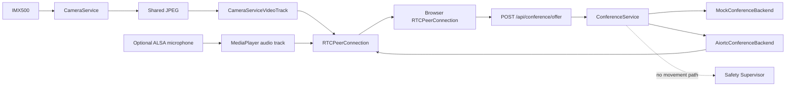

# Phase 9 — WebRTC Telepresence Transport

Phase 9 adds the first real-time telepresence transport boundary. It introduces WebRTC session lifecycle, SDP signaling, session cleanup, a browser validation page, optional STUN/TURN configuration, and an `aiortc` backend that publishes the already-owned `CameraService` video stream.

Robot motion remains completely separate from conferencing.

## Goals

- keep camera ownership inside `CameraService`;
- never instantiate a second Picamera2 camera for WebRTC;
- expose a mockable conference transport for CI;
- support non-trickle SDP offer/answer signaling;
- cap concurrent sessions;
- explicitly close sessions;
- expire stale sessions;
- expose conference state;
- publish real IMX500 video through WebRTC;
- keep Raspberry Pi microphone publishing disabled until ALSA capture is validated;
- allow browser microphone reception on the Pi without connecting it to robot movement;
- keep TURN credentials/configuration external to source code.

## Architecture



## Safe defaults

```yaml
conference:
  enabled: true
  mode: mock
  required: false
  max_sessions: 2
  session_timeout_seconds: 1800
  ice_gathering_timeout_seconds: 5.0
  publish_video: true
  publish_audio: false
  audio_input_device: default
  allow_remote_audio: true
  ice_servers: []
```

`publish_audio: false` is deliberate. Phase 7 validates VAD/DoA over the XVF3800 USB control interface, but raw ALSA PCM capture still needs separate hardware validation before the conference backend should open it.

## API

### Status

```text
GET /api/conference/status
```

Response includes backend, running state, active session count, per-session connection/ICE state, and whether video/audio are being published.

### SDP offer

```text
POST /api/conference/offer
Content-Type: application/json
```

Request:

```json
{
  "type": "offer",
  "sdp": "...browser SDP offer..."
}
```

Response:

```json
{
  "session_id": "...",
  "type": "answer",
  "sdp": "...Pi SDP answer..."
}
```

Phase 9 uses non-trickle ICE for simplicity: the browser gathers its local candidates before POSTing the offer, and the Pi returns its gathered candidates in the SDP answer.

### Close session

```text
DELETE /api/conference/sessions/{session_id}
```

### Browser validation page

```text
GET /conference
```

The page contains only conferencing controls. It deliberately contains no drive, servo, or motion controls.

## Mock validation

```bash
cd ~/ZeeAIBotWebCam
git pull
source .venv/bin/activate
pip install -e ".[dev]"
ruff check src tests
pytest -v

export HARDWARE_MODE=mock
export CAMERA_MODE=mock
export AUDIO_MODE=mock
export CONFERENCE_MODE=mock
python -m robotic_classroom.main
```

Open:

```text
http://localhost:8000/api/conference/status
http://localhost:8000/conference
```

Mock mode validates API/session behavior only. Its mock SDP answer is not intended to establish a real browser media connection.

## Real WebRTC installation

On the Raspberry Pi, install the optional transport dependencies:

```bash
source .venv/bin/activate
pip install -e ".[dev,webrtc]"
```

The optional extra installs `aiortc` and PyAV while leaving normal CI lightweight.

## First real LAN test: IMX500 video only

Keep all movement mocked and raw microphone publishing disabled:

```bash
export HARDWARE_MODE=mock
export CAMERA_MODE=imx500
export AUDIO_MODE=mock
export CONFERENCE_MODE=aiortc
export CONFERENCE_PUBLISH_AUDIO=false
python -m robotic_classroom.main
```

Forward port 8000 in VS Code Remote SSH or access the Pi on a trusted LAN, then open:

```text
http://localhost:8000/conference
```

Click **Connect**. The expected first milestone is:

- browser creates SDP offer;
- Pi creates `RTCPeerConnection`;
- WebRTC backend consumes `CameraService.jpeg()`;
- no second Picamera2 owner is created;
- browser receives live robot camera video;
- `/api/conference/status` shows one session;
- robot motors and servos remain untouched.

## Camera ownership

The real WebRTC track reads:

```text
CameraService.jpeg()
```

It does **not** instantiate:

```python
Picamera2(...)
IMX500(...)
```

This preserves the Phase 4 single-owner rule.

## Optional Pi microphone publishing

Do not enable this until `arecord -l` and an actual recording/playback test have identified the correct ReSpeaker ALSA capture device.

After validation, set for example:

```bash
export CONFERENCE_PUBLISH_AUDIO=true
export CONFERENCE_AUDIO_INPUT_DEVICE=hw:2,0
```

The exact ALSA identifier must come from the real Raspberry Pi; it must not be guessed from documentation.

The `aiortc` backend opens that device via `MediaPlayer(..., format="alsa")` and publishes its audio track to the browser.

## Browser microphone

The Phase 9 browser page can optionally send the browser microphone toward the Pi. The Pi currently drains this incoming audio track to keep the WebRTC session healthy; speaker playback/echo-control integration is a later phase.

This is intentional. We should not route remote audio to the robot speaker until the real playback device and acoustic echo path have been validated.

## STUN and TURN

Configuration supports:

```bash
export WEBRTC_ICE_SERVERS=stun:example.org:3478,turn:example.org:3478
export WEBRTC_ICE_USERNAME=...
export WEBRTC_ICE_CREDENTIAL=...
```

Do not commit TURN credentials to the repository.

The built-in browser test page is primarily a LAN validation tool in Phase 9. Production WAN conferencing requires a proper client ICE configuration, TURN credential strategy, TLS, authentication, and deployment topology; these belong to production hardening rather than being guessed during hardware bring-up.

## Session safety

Phase 9 includes:

- configurable `max_sessions`;
- explicit session IDs;
- close endpoint;
- stale-session cleanup;
- connection/ICE status exposure;
- conference shutdown during application shutdown.

No conference endpoint exposes a robot movement command.

## Privacy

Phase 9 does not enable recording. Existing defaults remain:

```yaml
privacy:
  recording_enabled: false
  face_recognition_enabled: false
```

A live WebRTC session transmits media to the connected peer, so future production UI must provide clear camera/microphone/conference indicators and authenticated session controls.

## Definition of done

Phase 9 is complete when:

- conference mock tests pass;
- `/api/conference/status` works;
- mock offer/session lifecycle works;
- real `aiortc` dependencies install on Raspberry Pi;
- `/conference` establishes a LAN WebRTC session;
- real IMX500 video arrives in the browser;
- camera remains single-owned;
- session close works;
- optional ALSA audio stays disabled until separately validated;
- no conference code has actuator access.

After that, Phase 10 should focus on the operator/conference UI, authenticated session controls, media-device validation, remote audio playback, and production networking before any remote robot-driving endpoint is considered.
