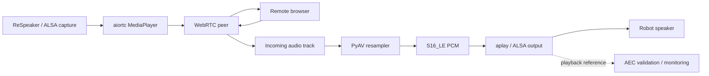

# Phase 11 — Full-Duplex Audio and Echo Management

Phase 11 extends the WebRTC transport with a gated full-duplex audio path. It supports Raspberry Pi microphone publishing to the remote browser and remote browser audio playback through a configured ALSA output device, while keeping both directions disabled until the corresponding hardware paths are explicitly validated.

## Safety and validation rule

Configuration is not proof of hardware readiness. Three independent validation gates are used:

```yaml
conference:
  publish_audio: false
  audio_input_validated: false
  remote_audio_playback: false
  audio_output_validated: false
  echo_management_mode: monitor
  echo_reference_validated: false
```

Real microphone publishing refuses to start when `publish_audio: true` but `audio_input_validated: false`.

Real speaker playback refuses to start when `remote_audio_playback: true` but `audio_output_validated: false`.

If `echo_management_mode: aec_reference` is selected, the WebRTC backend refuses to start until `echo_reference_validated: true`.

## Audio architecture



The speaker path is isolated in:

```text
src/robotic_classroom/conference/audio_playback.py
```

The WebRTC backend does not write speaker samples directly.

## Audio pipeline status

```text
GET /api/conference/audio-pipeline
```

The response reports:

- microphone publishing enabled/disabled;
- microphone input validation state;
- selected ALSA capture device;
- remote audio allowed;
- speaker playback enabled/disabled;
- speaker output validation state;
- selected ALSA playback device;
- playback running state and written frame count;
- last playback error;
- echo-management mode;
- echo-reference validation state;
- whether full duplex is requested;
- whether all required validation gates are satisfied;
- `movement_requested: false`.

## Step 1 — identify real Raspberry Pi audio devices

```bash
arecord -l
aplay -l
```

Do not guess device numbers.

## Step 2 — validate microphone capture

After identifying the actual capture card/device:

```bash
arecord -D hw:X,Y -f S16_LE -r 48000 -c 1 -d 5 test-mic.wav
```

Listen to the file through a known-good playback path.

Only then enable:

```bash
export CONFERENCE_AUDIO_INPUT_DEVICE=hw:X,Y
export CONFERENCE_AUDIO_INPUT_VALIDATED=true
export CONFERENCE_PUBLISH_AUDIO=true
```

## Step 3 — validate speaker playback

After identifying the actual playback card/device:

```bash
aplay -D hw:A,B test-mic.wav
```

Start at a conservative amplifier/speaker volume.

Only after successful playback enable:

```bash
export CONFERENCE_AUDIO_OUTPUT_DEVICE=hw:A,B
export CONFERENCE_AUDIO_OUTPUT_VALIDATED=true
export CONFERENCE_REMOTE_AUDIO_PLAYBACK=true
```

The browser must also enable **Send browser microphone to the Pi** for a remote audio track to exist.

## Step 4 — echo management

Initial real full-duplex testing should use:

```bash
export CONFERENCE_ECHO_MANAGEMENT_MODE=monitor
export CONFERENCE_ECHO_REFERENCE_VALIDATED=false
```

`monitor` means the system permits a validated full-duplex transport path but does not claim that acoustic echo cancellation has been proven.

Measure:

- audible echo at the remote side;
- howl/feedback tendency;
- microphone VAD behavior while the robot speaker is active;
- DoA stability while remote audio plays;
- comfortable speaker volume;
- whether the chosen playback path is visible to the XVF3800 AEC reference path.

Only when the hardware-specific AEC/reference route is verified should you use:

```bash
export CONFERENCE_ECHO_MANAGEMENT_MODE=aec_reference
export CONFERENCE_ECHO_REFERENCE_VALIDATED=true
```

The software does not fabricate AEC. It records the validation state and blocks `aec_reference` mode until the path has been physically proven.

## Safe first Phase 11 run

```bash
cd ~/ZeeAIBotWebCam
git pull
source .venv/bin/activate
pip install -e ".[dev,webrtc]"
ruff check src tests
pytest -v

export HARDWARE_MODE=mock
export CAMERA_MODE=imx500
export AUDIO_MODE=xvf3800_usb
export CONFERENCE_MODE=aiortc
export CONFERENCE_PUBLISH_AUDIO=false
export CONFERENCE_AUDIO_INPUT_VALIDATED=false
export CONFERENCE_REMOTE_AUDIO_PLAYBACK=false
export CONFERENCE_AUDIO_OUTPUT_VALIDATED=false
export CONFERENCE_ECHO_MANAGEMENT_MODE=monitor
python -m robotic_classroom.main
```

Then inspect:

```text
http://localhost:8000/api/conference/media-devices
http://localhost:8000/api/conference/audio-pipeline
http://localhost:8000/conference
```

## Full-duplex activation sequence

Do not enable both directions at once during first hardware bring-up. Recommended order:

1. video only;
2. Pi microphone uplink only;
3. remote speaker downlink only;
4. both directions together in `monitor` mode;
5. measure echo and feedback;
6. validate the AEC/reference path if the selected hardware supports it;
7. only then use `aec_reference` mode.

## Robot-motion boundary

Audio transport has no actuator access. Phase 11 does not add a motor or servo endpoint, and the audio status response explicitly reports:

```json
"movement_requested": false
```

## Next phase

Phase 12 should focus on calibrated pan/tilt execution behind the Safety Supervisor, but only after the second servo/channel problem is resolved and the pan/tilt mechanical limits are measured. Chassis movement should remain locked until motor mapping, power behavior, and an independent asynchronous deadman are validated.
